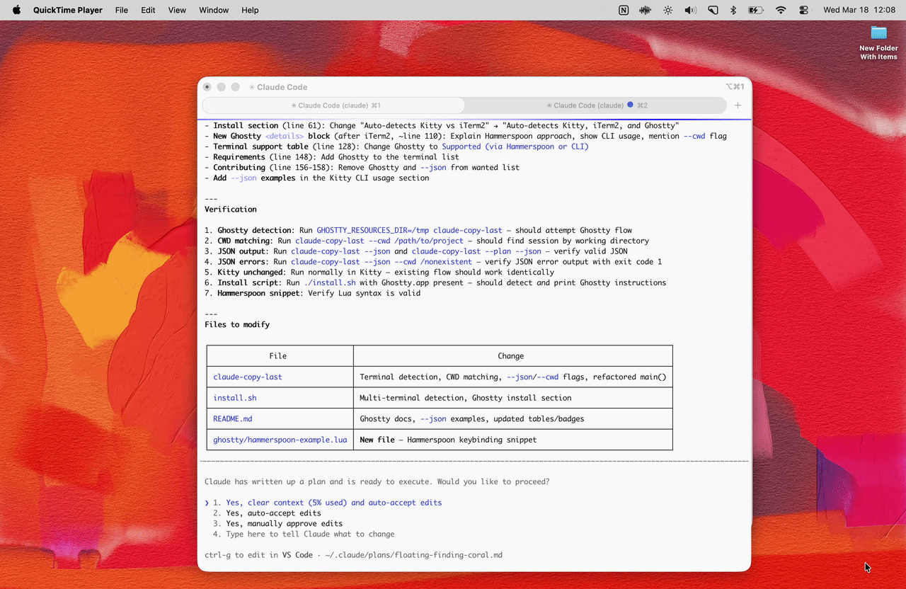

# claude-copy

**Copy Claude Code output from the focused tab. Instantly.**

Last response. Latest plan. Exact `AskUserQuestion` prompt + options.

No mouse. No scrolling. No text selection.




---

| Shortcut | Copies |
|---|---|
| `Cmd+Shift+C` | Last Claude Code response in active tab |
| `Cmd+Shift+P` | Latest plan (from `.claude/plans/`) in active tab |
| `Cmd+Shift+A` | Last `AskUserQuestion` + answer options in active tab |

> Suggested defaults — remap if these conflict with your existing shortcuts.

---

## Built for double-tap

Ask Claude Code to think, plan, or build → copy the output → paste into a second model for review. Better quality. Fewer blind spots. Less back-and-forth.

**claude-copy makes the handoff instant.**

### Review plans before execution

Claude Code writes a plan. You want a second opinion before hitting Enter. `Cmd+Shift+P` → paste into ChatGPT / Gemini → *"Find the bugs in this plan before I let Claude run it."*

### Second opinion on long answers

Claude finishes a complex implementation. You're not sure about the approach. `Cmd+Shift+C` → paste into another model → *"Review this. What did it miss?"*

### Let a reasoning model pick when Claude gets stuck

Claude asks you to pick between three options and you don't know which. `Cmd+Shift+A` → paste the exact question + options into Gpt 5.4 / Gemini → *"Which option should I pick and why?"*

---

## Install

```bash
git clone https://github.com/clementrog/claude-copy.git && cd claude-copy && ./install.sh
```

Auto-detects Kitty vs iTerm2.

<details open>
<summary><strong>Kitty</strong> (recommended)</summary>

The installer copies `claude-copy-last` to `~/.local/bin/` and tells you what to add to your Kitty config.

Add to `~/.config/kitty/kitty.conf` if not already present:

```conf
allow_remote_control yes
listen_on            unix:/tmp/kitty-{kitty_pid}

map cmd+shift+c launch --type=background sh -c '~/.local/bin/claude-copy-last | pbcopy'
map cmd+shift+p launch --type=background sh -c '~/.local/bin/claude-copy-last --plan | pbcopy'
map cmd+shift+a launch --type=background sh -c '~/.local/bin/claude-copy-last --ask | pbcopy'
```

Restart Kitty. Done.

CLI usage:

```bash
claude-copy-last | pbcopy           # last response in active tab
claude-copy-last --plan | pbcopy    # plan in active tab
claude-copy-last --ask | pbcopy     # last question + options in active tab
claude-copy-last --help             # all options
```

</details>

<details>
<summary><strong>iTerm2</strong> (supported, more manual)</summary>

The installer copies the script to `~/Library/Application Support/iTerm2/Scripts/AutoLaunch/claude_copy.py`.

One-time setup:

1. **Enable Python API** — Preferences → General → Magic → Enable Python API
2. **Install runtime** — Scripts → Manage → Install Python Runtime
3. **Restart iTerm2**
4. **Add key bindings** — Preferences → Keys → Key Bindings → Action: "Invoke Script Function"

| Shortcut | Function |
|---|---|
| `Cmd+Shift+C` | `claude_copy_response(session_id: id)` |
| `Cmd+Shift+P` | `claude_copy_plan(session_id: id)` |
| `Cmd+Shift+A` | `claude_copy_ask(session_id: id)` |

</details>

---

## How it works

Not terminal scraping. `claude-copy` finds the focused tab's process, maps it to the right Claude Code session in `~/.claude/`, reads the JSONL transcript, and copies the requested content. It doesn't care about your font size, window dimensions, or ANSI colors — it reads the raw session data.

That's why it's instant and always copies from the right tab.

---

## Terminal support

| Terminal | Status |
|---|---|
| **Kitty** | Supported, recommended |
| **iTerm2** | Supported |
| **Ghostty** | [Help us add it →](https://github.com/clementrog/claude-copy/issues) |
| **Warp** | PRs welcome |
| **Zed terminal** | PRs welcome |
| **macOS Terminal** | Not supported (no tab PID API) |

`claude-copy` needs a way to get the focused tab's process ID. If your terminal exposes this, [open an issue](https://github.com/clementrog/claude-copy/issues).

---

## Stability

Reads Claude Code's local session files in `~/.claude/`. If Anthropic changes the session format, extraction logic may need updates.

---

## Requirements

- macOS
- Python 3.8+
- [Claude Code CLI](https://docs.anthropic.com/en/docs/claude-code)
- Kitty or iTerm2

---

## Contributing

Issues and PRs welcome. High-value contributions:

- **Terminal support** — Ghostty, Warp, Zed
- **Linux support**
- **`--json` flag** for structured output
- Better error handling and diagnostics

---

## License

MIT

---

**If this saves you time, [star the repo](https://github.com/clementrog/claude-copy).**
